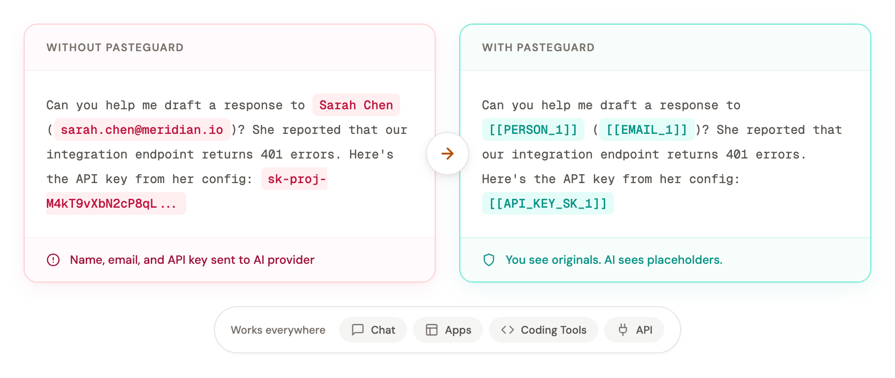
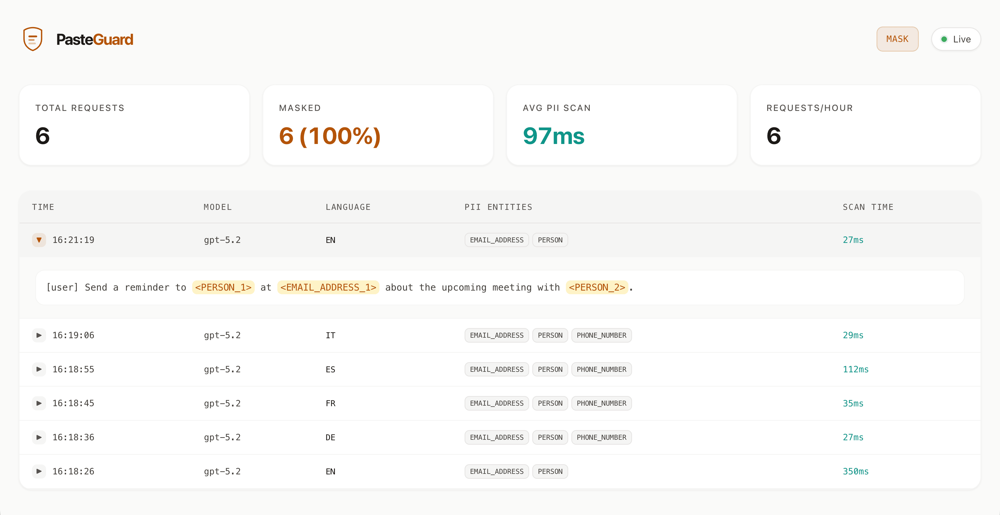

<p align="center">
  <picture>
    <source media="(prefers-color-scheme: dark)" srcset="assets/wordmark-dark.svg">
    <source media="(prefers-color-scheme: light)" srcset="assets/wordmark-light.svg">
    
  </picture>
</p>

<p align="center">
  <a href="https://github.com/sgasser/pasteguard/actions/workflows/ci.yml"></a>
  <a href="LICENSE"></a>
  <a href="https://github.com/sgasser/pasteguard/releases"></a>
</p>

<p align="center">
  <strong>Enterprise AI Security Gateway</strong><br>
  PromptWall provides zero-trust privacy protection, policy-driven routing, and threat prevention before prompts reach AI model providers.
</p>

<p align="center">
  <a href="#browser-chat"><strong>Browser Chat</strong></a> ·
  <a href="#apps--apis"><strong>Apps & APIs</strong></a> ·
  <a href="#coding-agents"><strong>Coding Agents</strong></a> ·
  <a href="#platform-roadmap"><strong>Roadmap</strong></a> ·
  <a href="https://pasteguard.com/docs"><strong>Documentation</strong></a>
</p>

<br/>

<picture>
  <source media="(prefers-color-scheme: dark)" srcset="assets/comparison-dark.png">
  <source media="(prefers-color-scheme: light)" srcset="assets/comparison.png">
  
</picture>

<p align="center">
  You keep sensitive context inside your perimeter. Model providers receive sanitized payloads.<br>
  Deploy locally or as an Enterprise Security Gateway in your existing cloud infrastructure.
</p>

## Enterprise AI Security Platform

PromptWall is an enterprise security gateway designed to give organizations complete visibility and policy control over AI traffic across all model providers.

### Core Pillars

- 🛡️ **Privacy Protection**: Zero-trust masking for PII, PCI data, medical records, and enterprise credentials with lossless streaming response restoration.
- 🔀 **Policy-Driven Routing**: Intelligent routing based on data sensitivity — automatically route clean requests to cloud LLMs while keeping sensitive prompts on local/on-premise models.
- 🔌 **Multi-Provider Architecture**: Unified protocol adapter for OpenAI, Anthropic, Codex, and custom OpenAI-compatible enterprise endpoints.
- 📊 **Central Governance & Auditing**: Comprehensive real-time dashboard, audit logging (SQLite/Postgres), entity analytics, and compliance telemetry.

---

## Where PromptWall Protects

PromptWall operates seamlessly across three primary deployment surfaces:

### Browser Chat

**ChatGPT, Claude, and Gemini.** Employees can paste customer notes, support tickets, candidate details, or internal operational context without exposing raw data to cloud providers. You see the original response; cloud models interact solely with secure placeholders.

The browser extension integrates directly with web interfaces.

**[Install the extension →](https://pasteguard.com/browser-extension)** · **[Chat docs →](https://pasteguard.com/docs/use-cases/chat)**

### Apps & APIs

**Production Applications, Internal Microservices, and AI Agents.** Route all upstream LLM SDK calls through PromptWall by updating your provider base URL.

PromptWall automatically masks outgoing requests, enforces data loss prevention (DLP) rules, forwards requests upstream, and streams restored placeholders back to caller applications.

**[Apps & APIs docs →](https://pasteguard.com/docs/use-cases/api-integration)**

### Coding Agents

**Codex, Claude Code, Cursor, Windsurf, Copilot, and CLI tooling.** Agent prompts frequently include internal source code, stack traces, environment variables, test credentials, and customer database fixtures. PromptWall intercepts and masks secret keys and PII before developers send context to cloud LLMs.

**[Coding Agents docs →](https://pasteguard.com/docs/use-cases/coding-tools)**

---

## Quick Start

Run PromptWall Gateway with Docker:

```bash
docker run --rm -p 3000:3000 ghcr.io/sgasser/pasteguard:latest
```

Access the admin dashboard at [http://localhost:3000/dashboard](http://localhost:3000/dashboard).

Point your application or agent to PromptWall:

| Target Provider | PromptWall Gateway URL | Original Provider URL |
|---|---|---|
| OpenAI | `http://localhost:3000/openai/v1` | `https://api.openai.com/v1` |
| Anthropic | `http://localhost:3000/anthropic` | `https://api.anthropic.com` |
| Codex CLI | `http://localhost:3000/codex` | `https://chatgpt.com/backend-api/codex` |

```python
from openai import OpenAI

# Connect to PromptWall Enterprise Gateway
client = OpenAI(base_url="http://localhost:3000/openai/v1")
```

For advanced YAML configuration, Postgres persistence, Docker Compose, or custom GLiNER detector tuning, see the **[Deployment Guide](https://pasteguard.com/docs/installation)**.

---

## Operating Modes

<details>
<summary><strong>Mask Mode (Zero-Trust Privacy)</strong></summary>

Mask Mode automatically detects and replaces PII and enterprise secrets with cryptographic placeholders before requests reach upstream AI models. Streamed and non-streamed responses are dynamically unmasked before delivery to the client.

</details>

<details>
<summary><strong>Route Mode (Policy-Driven Fallback)</strong></summary>

Route Mode inspects payloads in real time. Payloads containing sensitive data are automatically routed to private local/on-premise LLMs (e.g., Ollama, vLLM, llama.cpp), while non-sensitive requests are directed to public cloud providers for maximum cost and speed optimization.

**[Read Route Mode Documentation](https://pasteguard.com/docs/concepts/route-mode)**

</details>

---

## Detection Capabilities

- **Personal Identifiable Information (PII)**: Multilingual extraction of names, locations, email addresses, phone numbers, credit card numbers, IBANs, IP addresses, and EU VAT identification numbers using GLiNER ML models and checksum algorithms.
- **Secrets & Credentials**: Deterministic regex and entropy detection for OpenAI, Anthropic, Stripe, AWS, GitHub, SSH/PEM keys, JWT tokens, Bearer headers, and database connection strings.

All detection occurs in real-time streaming mode without adding perceptable latency.

---

## Admin Dashboard

Monitor security events, PII entity statistics, request volume, scan latencies, and audit trails in real time.



Visit [http://localhost:3000/dashboard](http://localhost:3000/dashboard).

---

## Platform Roadmap

PromptWall is advancing from a local privacy proxy into a full Enterprise AI Security Gateway platform.

- [x] **v0.8 — Core AI Gateway Foundation**: High-throughput Bun/Hono core, multi-provider support (OpenAI, Anthropic, Codex), real-time PII & secret streaming detection, and live dashboard.
- [ ] **v0.9 — Enterprise Policy Engine**: Role-based policy controls, customizable regex/DLP policy rules, fallback circuit breakers, and expanded secret detection coverage.
- [ ] **v1.0 — Platform Governance & Multi-Tenancy**: Team workspace isolation, SSO / OIDC authentication, granular API key quota management, SIEM telemetry export (OpenTelemetry, Datadog), and custom model fine-tuning adapters.
- [ ] **v1.1 — Advanced Threat & Prompt Injection Defense**: Real-time prompt injection detection, hallucination monitoring, and automated safety guardrails for autonomous AI agent networks.

---

## Tech Stack

[Bun](https://bun.sh) · [Hono](https://hono.dev) · [GLiNER](https://github.com/urchade/GLiNER) + [python-stdnum](https://arthurdejong.org/python-stdnum/) ([`detector/`](detector/)) · SQLite / PostgreSQL

## Contributing

We welcome community contributions! Please review [CONTRIBUTING.md](CONTRIBUTING.md) for contribution standards.

## License

[Apache 2.0](LICENSE)
=======
# 🛡️ PromptWall

> **Enterprise AI Security Gateway for LLM Applications**

PromptWall is an enterprise-grade AI security gateway that protects Large Language Model (LLM) applications from sensitive data leakage by detecting, validating, and masking confidential information before it reaches AI providers.

Built with a modular, plugin-based architecture, PromptWall provides deterministic secret detection, multilingual PII detection, configurable security policies, and an extensible foundation for future AI security capabilities.

---

## 🚀 Why PromptWall?

Organizations are rapidly integrating AI into production systems, but prompts often contain sensitive information such as:

- API Keys
- Cloud Credentials
- Database Connection Strings
- Personally Identifiable Information (PII)
- Financial Data
- Authentication Tokens
- Internal Business Secrets

Sending this information directly to external LLM providers introduces significant security and compliance risks.

PromptWall acts as a security layer between applications and AI providers by automatically detecting, validating, and masking sensitive information before requests leave your infrastructure.

---

# ✨ Core Features

### 🔐 Secret Detection

Detects sensitive credentials including:

- OpenAI
- Anthropic
- Google AI
- Groq
- Hugging Face
- OpenRouter
- DeepSeek
- AWS
- Azure
- Cloudflare
- GitHub
- GitLab
- Docker
- Kubernetes
- Stripe
- Twilio
- MongoDB
- PostgreSQL
- Redis
- Snowflake
- JWT
- Bearer Tokens
- Private Keys
- Environment Secrets

---

### 👤 Personally Identifiable Information (PII)

Supports deterministic and ML-assisted detection of:

- Email Addresses
- Phone Numbers
- Credit Cards
- IBAN
- VAT Numbers
- Aadhaar
- PAN
- GSTIN
- Passport Numbers
- Driving License
- Voter ID
- IFSC
- UPI IDs

---

### 🧠 Intelligent Detection Pipeline

PromptWall performs multiple analysis stages:

- Input Classification
- Smart Decoder
- Unicode Normalization
- Fragment Reassembly
- Secret Detection
- PII Detection
- Validation
- Context Analysis
- Confidence Scoring
- Metadata Generation
- Secret Fingerprinting
- Secure Masking

---

## 🏗 Architecture

```
Client Application
        │
        ▼
┌──────────────────────┐
│ Input Classifier     │
└──────────┬───────────┘
           ▼
┌──────────────────────┐
│ Smart Decoder        │
└──────────┬───────────┘
           ▼
┌──────────────────────┐
│ Normalizer           │
└──────────┬───────────┘
           ▼
┌──────────────────────┐
│ Fragment Reassembly  │
└──────────┬───────────┘
           ▼
┌────────────────────────────────────────────┐
│ PII │ Secrets │ Entropy Detection (Parallel)
└──────────┬─────────────────────────────────┘
           ▼
┌──────────────────────┐
│ Validation           │
└──────────┬───────────┘
           ▼
┌──────────────────────┐
│ Context Analysis     │
└──────────┬───────────┘
           ▼
┌──────────────────────┐
│ Confidence Engine    │
└──────────┬───────────┘
           ▼
┌──────────────────────┐
│ Metadata + Masking   │
└──────────────────────┘
           ▼
      AI Provider
```

---

# 🧩 Architecture Principles

PromptWall is designed around several core engineering principles:

- Plugin-based architecture
- Backward-compatible APIs
- Deterministic validation
- Explainable detection decisions
- Performance-first execution
- Enterprise observability
- Secure-by-default design
- Configurable policy enforcement

---

# 🛠 Technology Stack

### Backend

- TypeScript
- Bun
- Hono
- Python
- FastAPI

### Detection

- Regular Expressions
- GLiNER
- libphonenumber
- python-stdnum

### Infrastructure

- Docker
- SQLite
- PostgreSQL

---

# 📂 Project Structure

```
PromptWall/

├── src/
├── detector/
├── plugins/
├── docs/
├── tests/
├── docker/
├── examples/
└── README.md
```

---

# 📈 Current Status

| Component | Status |
|-----------|--------|
| Core Gateway | ✅ Implemented |
| Secret Detection | 🚧 In Progress |
| Validation Engine | 🚧 In Progress |
| Context Engine | 🚧 In Progress |
| Plugin SDK | 🚧 Planned |
| Threat Intelligence | 🚧 Planned |
| Streaming Detection | 🚧 Planned |
| Policy Engine | 🚧 Planned |
| Compliance Engine | 🚧 Planned |

> Update this table as development progresses.

---

# 🎯 Project Goals

- Detect sensitive information before it reaches LLMs
- Minimize false positives through validation
- Provide explainable security decisions
- Support enterprise-scale deployments
- Offer a modular SDK for custom detectors
- Build an extensible AI security platform

---

# 🤝 Contributing

Contributions are welcome.

Please read the documentation before submitting pull requests.

Future contributor documentation will include:

- Detector Development Guide
- Plugin SDK Guide
- Architecture Decision Records (ADRs)
- Security Guidelines

---


---

# ⭐ Vision

PromptWall aims to become a comprehensive security layer for AI applications by combining deterministic detection, machine learning, policy enforcement, and enterprise observability into a unified platform for protecting sensitive information in LLM workflows.
